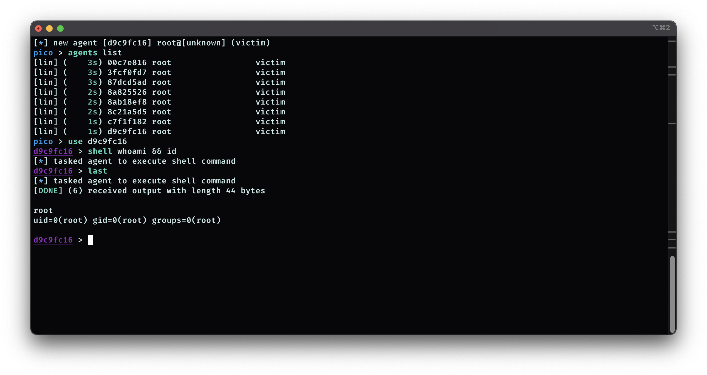

# Pico C2

Pico is a C2 framework that allows you to connect your agents and listeners written in any programming language.

> :warning: Pico C2 is in the early stages of development. The API and functionality may change over time!

## Why Another C2 Framework?

Unlike other C2 frameworks, such as Cobalt Strike, Pico does not offer pre-built listeners or agents. Instead, you have full control over the development process. You can create your own custom listener and payloads, implement a communication protocol that suits your needs, and then integrate these components with Pico using gRPC.

Also, Pico includes its own programming language, [PLAN](https://github.com/PicoTools/plan), which is designed for automating tasks (similar to agressor scripts for Cobalt Strike).
